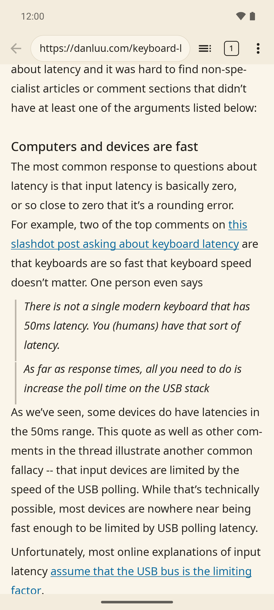
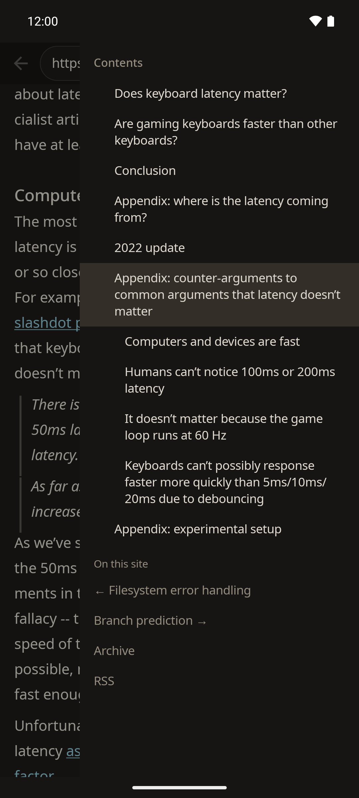

<p align="center">
  
</p>

# Brevier

A browser for reading, and nothing else. It fetches a page, reduces it to Markdown on
your own machine, and sets it in the typography *you* chose — not the one the site
shipped. It also reads Markdown documentation straight out of git repositories, reads feeds
as lists of links, and searches the web from the address bar.

No JavaScript engine, no site CSS. The modern web ships a document wrapped in a program;
Brevier keeps the document and throws the program away. The site gets a vote on the words.
Not on the type.

Why it is built this way is in the [manifesto](MANIFESTO.md); what comes next, and what
has been decided, is in the [roadmap](ROADMAP.md) — every near-term item there is an open
issue labelled `roadmap`.

**Status: early.** Brevier runs on Linux, as a window, and on Android, as an app over the
same core. There is a Flatpak bundle, a tarball and an APK to download, nothing in a store
yet, and screen readers are known to work on Linux only (see
[What it does not do](#what-it-does-not-do)).


## Not a converter

"Web page → Markdown" is a shelf product, and Brevier does not pretend otherwise: the
pipeline is built from other people's crates (`dom_smoothie` for extraction, `htmd` for
conversion). The difference is what the Markdown is *for*. Converters make it data for a
machine — food for a model, an index, an archive. Here it is plumbing you never see, and
the product is the window: your measure, your leading, your type, on every site.

## Install

Nothing is in a store yet — builds for Linux and Android in the
[releases](https://github.com/gurov/brevier/releases/latest), and the source.

**A Flatpak bundle.** One file, one command; the runtime brings GTK, so it does not care
which distribution is underneath:

```sh
wget https://github.com/gurov/brevier/releases/download/v0.6.0/brevier.flatpak
flatpak install --user ./brevier.flatpak
flatpak run io.github.gurov.brevier https://example.com/article
```

The first install also pulls `org.gnome.Platform//49` from Flathub if it is missing —
about 400 MB, once for every Flatpak that uses it. After that Brevier is in the menu like
any other application. To build the bundle yourself, see `packaging/`: the build runs
offline the way Flathub's does, every crate declared with its checksum in
`packaging/cargo-sources.json` (regenerate it with `packaging/cargo-sources.py` after
bumping a dependency).

What the sandbox changes, stated rather than discovered later: history, bookmarks and
settings live in `~/.var/app/io.github.gurov.brevier/`; saving goes through the file
portal; a local path — a `.md`, a saved feed — cannot be opened, because the sandbox gets
no filesystem access at all; and "Open in your browser" asks the portal, so the host picks.

**A tarball**, for a machine that already has GTK 4 and would rather not have a sandbox —
also in the [release](https://github.com/gurov/brevier/releases/latest), or built with
`packaging/tarball.sh`:

```sh
tar xf brevier-0.6.0-x86_64-linux.tar.gz
cd brevier-0.6.0-x86_64-linux && ./install.sh
```

`install.sh` puts the binaries, the desktop entry, the icon and the licenses under
`~/.local`, needs no root, and takes `--uninstall`. It wants GTK 4 in the system
(`libgtk-4-1` on Debian and Ubuntu) and a glibc no older than the build machine's.

**Android** (7.0 and later, 64-bit ARM — any phone from the last several years): download
[`brevier-0.6.0-arm64.apk`](https://github.com/gurov/brevier/releases/download/v0.6.0/brevier-0.6.0-arm64.apk)
on the phone and open it; Android asks once to allow installing apps from the browser or
file manager you opened it with. Updates install over it as long as they carry the same
signature — the release key, whose SHA-256 fingerprint is

```
30:A4:32:B8:2F:3E:F0:FC:E5:F4:68:1F:D7:F9:FE:20:5F:4B:17:A2:F4:34:19:C2:45:0C:A2:6B:E6:8D:34:80
```

Every file in a release is listed with its SHA-256 in `SHA256SUMS` next to it. Releases
are built by CI from the tag, not on a laptop. To build from source — the cli, the window
or the Android app — see [CONTRIBUTING.md](CONTRIBUTING.md#building).

## Making it your browser

The desktop entry — installed by the Flatpak, by `install.sh`, or by hand — declares
`http`, `https` and `feed://` links, Markdown, and RSS, Atom and JSON feed files, so
Brevier turns up in "Open with". It does not make itself the default
(`xdg-settings set default-web-browser io.github.gurov.brevier.desktop` if you want that).
Made default it still lets you out — `Ctrl+O` hands the page to the first registered
browser that is not Brevier, or, inside a Flatpak, to the portal. On Android, Settings has
**Make default**, which opens the system's own dialog.

The id is `io.github.gurov.brevier`, after the repository — the form Flathub's rules give a
project on GitHub, since `brevier.dev` is not ours yet. If the entry shows up in the menu
without its icon, the shell cached its icon themes before the directory existed: log out
and back in, or restart the shell.

## Use

```sh
brevier https://example.com/article     # Markdown on stdout
brevier https://example.com/feed.xml    # an RSS, Atom or JSON feed, as a list of links
brevier gh:rust-lang/book               # a repository's README
brevier gh:rust-lang/book/src           # the README of a directory inside it
brevier gh:rust-lang/book/src/          # …or what the directory holds, listed
brevier gl:owner/repo                   # the same for GitLab
brevier --docs gh:rust-lang/book        # entry points into its documentation
brevier --check <url> [<url>…]          # score pages for a scriptless reader
brevier --links <url>                   # the article's outgoing links, one per line
brevier --nav <url>                     # the site's own navigation: menu and footer
brevier --raw <url>                     # no extraction, the whole page
brevier --html <url>                    # the extracted HTML, before conversion
brevier --stdin <url> < page.html       # HTML you already have; the url is
                                        # where it came from, for its links
brevier --save <url>                    # write it to a file instead of stdout
brevier brevier:history                 # what you have read, by day
brevier "borrow checker"                # not an address: a search, results as links
brevier "?danluu.com"                   # a leading ? searches for anything

brevier-ui <url> [<url>…]               # read in a window, one tab per address
```

A pasted GitHub or GitLab file URL is understood too, and so is a `feed://` link, a path to
a local `.md` or a saved feed.
`--save` (in the `ui` build) writes `.md`, or a `.zip` of the text plus an `images/` folder
when the page has pictures; `-o` names the file, and without it an existing file of the
article's name stops the run rather than being overwritten.

`brevier-ui` takes as many addresses as you like, a tab each. It is a single application:
an address handed to it while it runs — from the command line, or a link you clicked in
another program — opens as a tab in the window you already have, the way a browser does.
Launching it with no address opens another window, which is how you ask for one.

Below is a chapter of the Rust book, `gh:rust-lang/book/src/ch03-02-data-types.md`, read
straight out of the repository in the same type as any article — the book's documentation
and contributing guide on the shelf, above the chapter's contents:


Exit codes: 1 bad url, 2 network, 3 http status, 4 content type, 5 nothing extracted,
6 conversion (or a feed too broken to repair) — so a batch run can tell "the site refused"
from "extraction failed".

### Checking your own site

`--check` scores a page 0 to 100 for a reader that runs no scripts, prints what to change
and what each finding cost, and exits non-zero below `--min` (80 by default). In the window
the same report opens from the menu, **Check this page**, or at `brevier:check/<url>`:


In CI it is a GitHub Action, built from this repository at the ref you name:

```yaml
- uses: gurov/brevier@v0.6.0   # a release tag, or @main
  with:
    urls: |
      https://example.com/
      https://example.com/docs/getting-started
    min: 80                      # fail the job below this
    badge: brevier-check.svg     # optional: an SVG with the lowest score
```

The reports go to the job summary; the lowest score is the step's `score` output.

## Keys

| | |
|---|---|
| `Enter` | open the address |
| `Space` / `Backspace`, `PageDown` / `PageUp` | page down / up |
| arrows, `Home`/`End` | line, top, bottom |
| `Tab` / `Shift+Tab` | mark the next / previous link on the page |
| `Enter` / `Ctrl+Enter` on a marked link | follow it / open it in a new tab |
| `Ctrl+L` | focus the address bar |
| `Ctrl+R`, `F5` | load the page afresh, past the saved copy |
| `Ctrl+T` / `Ctrl+W` | new tab / close tab |
| `Ctrl+H` | what you have read |
| `Ctrl+D` | keep this page, or take it off again |
| `Ctrl+Tab`, `Ctrl+PageUp`/`PageDown` | switch tabs |
| `Ctrl+F` | find on page |
| `Ctrl++` / `Ctrl+-` / `Ctrl+0`, `Ctrl`+wheel | zoom the page in, out, back to 100% |
| `Ctrl+S` | save the article |
| `Ctrl+O` | hand the page to your system browser |

Ctrl+click and middle-click open a link in a new tab; middle-click a tab closes it.
The mouse's back and forward buttons go back and forward. Hovering a link shows where it
goes. Past the last link, `Tab` moves on to the header and the shelf, as in a browser.
A page that names the one after it (`rel="next"`: a series, a book chapter, a thread's
second page) ends with a **Next:** line, and `Space` at the very end goes on to it. Settings, history and bookmarks are one menu in the
header, under Reload and **Check this page**. Selection, copying and the context menu come
from GTK.

An article you have opened in the last week opens from a copy on disk, images included —
no fetch, no extraction — and the status line says how old the copy is. `Ctrl+R` fetches
the page as it is now. A list of links (a blog's front page, a directory) is always
fetched: its point is what is new. "Forget everything" in Settings deletes the copies with
the history.

## In the window

- **Typography is the reader's, not the site's.** Today that means Brevier's own defaults
  — 16.5pt, a measure of 36 ems (about 65 characters), 1.55 leading, and headings that are
  *lighter* than the text rather than bolder, because at a large size weight shouts instead
  of leading — plus zoom and the theme. A settings page for face, size and measure is on
  the roadmap.
- **Typesetting by the page's language.** When a page says what language it is in, lines
  break with hyphens by that language's patterns (English and Russian ship with Brevier),
  and in Russian and Czech no line ends on a one-letter preposition. It is typesetting, not
  editing: copying and find-on-page see the text without the soft hyphens, and the saved
  Markdown is untouched.
- **Ivory paper** (`#faf5ea`) instead of white, which glows on a screen; a warm dark theme
  is a switch away in Settings.
- **Page zoom on the browser's ladder** (67…200%) scales the whole typographic model, not
  just the body size — so a line still holds about 65 characters at every step. It is one
  step for the window, shared across tabs and kept for the run only.
- **Back and forward return you to where you were** — the same spot on the page, drawn from
  memory rather than fetched again, images already in place. An image that loads up above
  the viewport no longer jogs the text under your eyes.
- **Fonts ship inside the binary** — Noto Sans and Noto Sans Mono, under the OFL. If the
  operating system picked the type, the promise would not hold on any of the three.
- **A shelf on the right:** a repository's documentation on top, the page's table of
  contents under it with the section under your eyes marked as you scroll, then the feeds
  the page advertises ("This site has a feed"), and the site's own menu below that. Its
  width is yours, by dragging the divider.
- **Directories are browsable** — a trailing slash (`gh:owner/repo/docs/`) or the shelf's
  "Files in this directory" lists what is there, so a README that links to nothing is not a
  dead end. This is the one place the repository mode asks the hosting's API, and only when
  you ask: GitHub allows sixty such requests an hour without a token; everything else comes
  from the CDN, which has no limit.
- **Images load right away, and a switch turns them off** — the decoder is the one serious
  attack surface once JavaScript is gone, and closing it should be possible. A formula in a
  line of text is drawn as a canvas; an illustration gets its own line and a caption.
- **The address bar searches.** Anything that is not an address — a few words, a question,
  one word without a dot — goes to DuckDuckGo Lite, and the results come back as a list of
  links, the same view as a feed: the title, the site, a couple of lines. A leading `?`
  searches for anything, `?danluu.com` included; `localhost` and `name:port` stay addresses.
  When DuckDuckGo takes a search for a bot and shows a puzzle instead of results, Brevier
  says so and offers **Open in your browser** — it does not solve puzzles.
- **Verse is set as verse.** A poem marked line by line — FictionBook's `<v>` and `<stanza>`,
  which many e-libraries keep, or `verse`/`stanza`/`poem` classes — keeps its lines; stanzas
  are parted by an empty line, a line too long for the measure wraps with a hanging indent,
  and no line is hyphenated.
- **The start page remembers.** A new tab shows the five pages you read last, one line each,
  and a link to the whole history; on a first run there is nothing to show, so nothing is
  shown. Back on a tab's first page leads to it, so a tab opened from a link is never a dead
  end.
- **A page that is a list of links** (a blog front page, a section of a site) is shown as a
  list, and the status line says so, instead of pretending there was an article to find.
  An RSS, Atom or JSON feed opens the same way: each entry a link, with its date, its
  author and a couple of lines of its summary, in the order the feed gives them — from an
  address, a `feed://` link, or a file (on Android too, from Downloads or a file manager).
- **A feed that discusses one page reads as a thread** — a reddit thread, the comments on a
  WordPress post: the post in full, then every comment with its author and date, flat,
  because a feed does not say who answers whom. reddit's own pages are empty without
  JavaScript, so a reddit thread or subreddit is read through its feed.
- **Tabs come back.** Close the window with five things half-read and they are there next
  time: every tab, its back and forward, the tab and the line you were on. Only the tab you
  were on is fetched at startup; the rest load the moment you switch to one.
- **Pages you read are remembered, and the address bar suggests them** as you type. `Ctrl+H`
  opens the list itself, grouped by day; a star (`Ctrl+D`) keeps a page, and the bookmarks
  open from the menu.
- **"Not secure" is marked; there is no padlock.** A page that came over plain `http` says
  so in the address bar: anyone on the way could read and change it. A padlock is left out
  on purpose — readers took it for "this site is trustworthy", when all it means is "the
  channel is encrypted" — and a certificate the system does not trust is not opened at all.
- **A page that cannot be shown says why**, in words — a certificate the system does not
  trust, a site that wants a login, a page built by JavaScript — and offers **Open in your
  browser**, the one way out that does not depend on remembering `Ctrl+O`.

A feed opens as a list of links — here the Rust blog's, `blog.rust-lang.org/feed.xml`:


## On the phone

The Android app is a second front-end over the same core, not a port of the window. The
article is set in native text — not in a WebView — from the same page model, the same type
scale and the same palette, so an article reads the same on both.

- Tabs, the shelf, find on page, zoom (from the menu or with a pinch), saving as `.md` or
  `.zip` through the system's save dialog, history, bookmarks, settings, the dark theme, and
  a session that comes back. Back returns to the place you left.
- It can be the default browser, and "Open in your browser" still finds the others.
- It opens what other apps hand it: links, shared text with a link in it, `feed://` links,
  and feed or Markdown files from Downloads or a file manager.
- A long press on a link opens it in a new tab, copies it, or hands it to your browser.
- A very long page — a whole novel on one page — shows its first screen at once, and the
  rest is laid out a piece at a time while you read.
- With a keyboard attached, the window's shortcuts work: `Ctrl+L`, `T`, `W`, `F`, `S`, `H`,
  `D`, `O`, and `Alt+←` / `Alt+→` for back and forward.

It is in daily use on the maintainer's phone; it has not been tried with TalkBack yet.

<p align="center">
  
  
</p>

## How well does it work

On the M0 corpus of 108 live addresses: **80 readable — 74%**. Of the 89 pages that
actually reached the extractor, **80 — 90%**; the other 19 are closed by access rather than
by conversion (certificates 8, 403/401 7, host silent 2, empty behind an anti-bot 2).

The honest caveat: the rubric (`corpus/RUBRIC.md`) is ours, the scoring is by hand, and it
was relaxed once — knowing the numbers. A strict reading of the same markings gave 56%. So
those are the project's own regression figures, not a claim against anyone else.

Measured against someone else's ruler — `scrapinghub/article-extraction-benchmark`, 181
saved pages scored on word 4-grams — the whole reading pipeline gets **F1 0.929**
(precision 0.885, recall 0.978); extraction alone gets 0.951, against 0.947 for
Readability.js and 0.958 for trafilatura in the same table. It is a second opinion, not the
gate: that benchmark is news, and this program is for long-form, documentation and threads.

Extraction breaks constantly — sites change their markup and heuristics rot. That is the
permanent background of this kind of program, not a task that finishes.

## What it does not do

- **JavaScript** — never, in any form, not even "just for this one site".
- **Site CSS** — never; the typography is the reader's.
- **Forms, logins, cookies** — the web is read-only here, deliberately.
- **SPA sites** — honest degradation, plus "Open in your browser".
- **Video, audio, extensions** — no.
- **An AI model inside the product** — no. Conversion is not the bottleneck (90% of the
  pages that reach the extractor are readable), and the price would be hundreds of
  megabytes, seconds per article, non-deterministic output instead of byte-exact regression
  files, and the risk of handing the reader invented text in place of the author's.
- **Accessibility outside Linux** — GTK 4 speaks AT-SPI, so on the desktop screen readers
  work on Linux only; NVDA on Windows and VoiceOver on macOS would see nothing, which is one
  reason there are no builds for them yet. The Android app draws native text, which TalkBack
  should read, but that has not been tested. The price of the toolkit, stated plainly rather
  than by omission.
- **A store listing** — not yet. A Flatpak bundle, a tarball and an APK are in Releases;
  Flathub is on the roadmap, and with it the updates a bundle cannot deliver.
- **Privacy** — not sold here. Sites may track a reader exactly as they always could.

Known limitation: a table is a grid of widgets anchored in the text buffer, so find-on-page
and "copy everything" do not see its contents. The saved Markdown has it in full.

## Markdown

CommonMark + GFM, through `comrak` — "Markdown" without a dialect means nothing. One
representation serves both modes, which is what makes saving nearly free; the price is what
it cannot carry (tables nested in lists, definition lists, sub/sup, ruby), and
that loss is also the noise removal this program is for.

A site that serves Markdown is read exactly, no extraction in the way: `Accept:
text/markdown` comes first on every request, and a `<link rel="alternate"
type="text/markdown">` is followed when the first answer was HTML. Either way the status
line says the text is the author's own. Footnotes are reduced to GFM footnotes, and GitHub
alerts (`> [!NOTE]`) are read as alerts — a quote that says what it is, no coloured box.

## On the disk

History, open tabs and bookmarks are plain text, one line each, tab-separated:

```
~/.local/share/brevier/history.tsv       # Linux, or $XDG_DATA_HOME/brevier
~/.local/share/brevier/session.tsv       # …and the tabs you left open
~/.local/share/brevier/bookmarks.tsv     # …and the pages you kept
~/Library/Application Support/Brevier/   # macOS
%LOCALAPPDATA%\Brevier\                 # Windows
```

On Android the same files live in the app's own storage.

Settings (theme, images, the shelf) are in `$XDG_CONFIG_HOME/brevier/settings.tsv`, and a
cache goes to `$XDG_CACHE_HOME/brevier` — the fonts, and the week-long copies of the pages
you read, capped at 64 MB of text and 256 MB of images. Three directories, not one
profile, because you carry the first with you, edit the second by hand, and throw the third
away without looking. `BREVIER_DATA_DIR` moves all of them at once.

Text rather than a database: SQLite would mean a C library in a program that sells memory
safety, and a reading history is thousands of lines, not millions. The file is yours —
delete a line to forget a page, delete the file to forget everything, or use the button in
Settings that empties the journal and leaves bookmarks and tabs alone. Only the window
writes there; `brevier <url> | less` is a pipe tool and keeps no history. The reading place
in the session is an offset in the text, not in pixels, so a tab comes back where you left
it through a different window size, zoom or font.

## On the network

- **Not a crawler.** Brevier fetches the page you opened and what it takes to read it — its
  images, an alternate Markdown copy when offered, a dozen probes on a repository's CDN for
  where its documentation starts. It does not walk a site or fetch pages nobody asked for.
- **Three per-site rules, and no more so far.** reddit's pages are empty without
  JavaScript, so a reddit thread or subreddit is fetched as its `.rss` instead; reddit
  allows few requests in a row without an account, and when it asks to slow down, Brevier
  says so. royallib's reader loads a book by script, part by part; each part opens as a
  page of its own, its text fetched the way the site's script fetches it.
  A search goes to DuckDuckGo Lite — the one engine that answers a plain GET with plain
  HTML, without a key — and its results page is read by its own rule, links unwrapped from
  DuckDuckGo's click counter so they lead straight to the sites. The query leaves your
  machine for DuckDuckGo, as it would from any browser's search box.
- **The User-Agent is honest** — `Brevier/0.1`. Chosen by measurement, not principle: on our
  corpus a browser-shaped UA lost 7:0, every case a 403 from an anti-bot.
- **TLS trust is delegated to the operating system** (`rustls` + `rustls-platform-verifier`).
  No bundled root store, no way to skip verification — a site signed by a CA your system
  does not know will not open until that root is installed, exactly as `curl` behaves. On
  Android the system also checks that a certificate has not been revoked, and a site whose
  revocation list cannot be fetched does not open.

## Contributing

Patches and bug reports are welcome. How the code is laid out, how to build it, and what a
change needs before it is merged are in [CONTRIBUTING.md](CONTRIBUTING.md); what is
planned is in the [roadmap](ROADMAP.md) and the issues labelled `roadmap`.

## License

MIT OR Apache-2.0, at your option.

The bundled fonts are under the SIL Open Font License; `assets/fonts/OFL-NotoSans.txt` must
travel with any distribution — a condition of the OFL, separate from the license on the
code.
